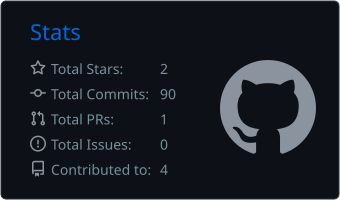
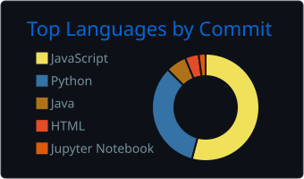

## Olá, eu sou a Thaís 👋

Analista de Testes Jr no **Instituto Conecthus**, com cerca de 2 anos em Quality Assurance em projetos de Pesquisa e Desenvolvimento. Certificada **ISTQB CTFL**.

- 🔍 Testes manuais funcionais, de regressão, exploratórios e de confirmação em aplicações web
- 🤖 Automação de testes web com Python e Selenium WebDriver
- 🔗 Testes de API REST com Postman, Bruno e Swagger
- 🗃️ Consultas SQL para validação de dados e gestão de defeitos no Jira
- 📉 Redução de 40% nos defeitos em produção com testes de regressão estruturados

📍 Manaus, AM · 📫 contato.thaissilva@outlook.com

### 📊 Estatísticas

  
  

### 🛠️ Habilidades

  
  
  
  
  

### 🧰 Ferramentas

  
  
  <svg xmlns="http://www.w3.org/2000/svg" width="256" height="256" fill="none" viewBox="0 0 256 256"><rect width="256" height="256" fill="#242938" rx="60"/><path fill="#2489CA" d="M33.7158 100.208C33.7158 100.208 28.9814 96.795 34.6627 92.2381L47.8994 80.402C47.8994 80.402 51.6869 76.4172 55.6915 79.8891L177.84 172.368V216.714C177.84 216.714 177.781 223.678 168.844 222.908L33.7158 100.208Z"/><path fill="#1070B3" d="M65.1997 128.792L33.7157 157.415C33.7157 157.415 30.4805 159.822 33.7157 164.123L48.3333 177.418C48.3333 177.418 51.8052 181.147 56.9341 176.905L90.3119 151.596L65.1997 128.792Z"/><path fill="#0877B9" d="M120.474 129.029L178.215 84.9391L177.84 40.83C177.84 40.83 175.374 31.2033 167.148 36.2139L90.312 106.145L120.474 129.029Z"/><path fill="#3C99D4" d="M168.844 222.968C172.198 226.4 176.262 225.276 176.262 225.276L221.259 203.103C227.019 199.177 226.21 194.305 226.21 194.305V61.8982C226.21 56.0788 220.252 54.0667 220.252 54.0667L181.253 35.267C172.731 30 167.148 36.2139 167.148 36.2139C167.148 36.2139 174.328 31.0455 177.84 40.83V215.905C177.84 217.109 177.583 218.292 177.071 219.358C176.045 221.429 173.816 223.362 168.47 222.553L168.844 222.968Z"/></svg>

### 🤝 Conecte-se comigo

### 🤝 Conecte-se comigo

